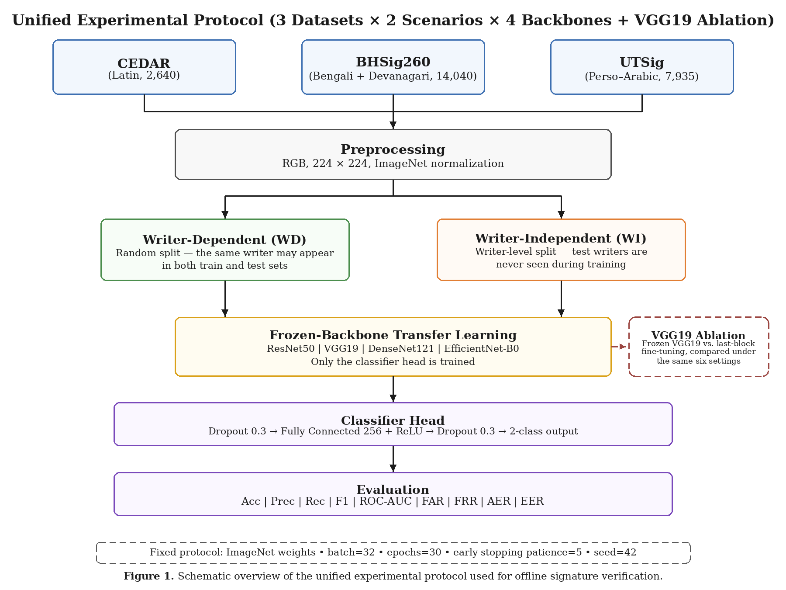
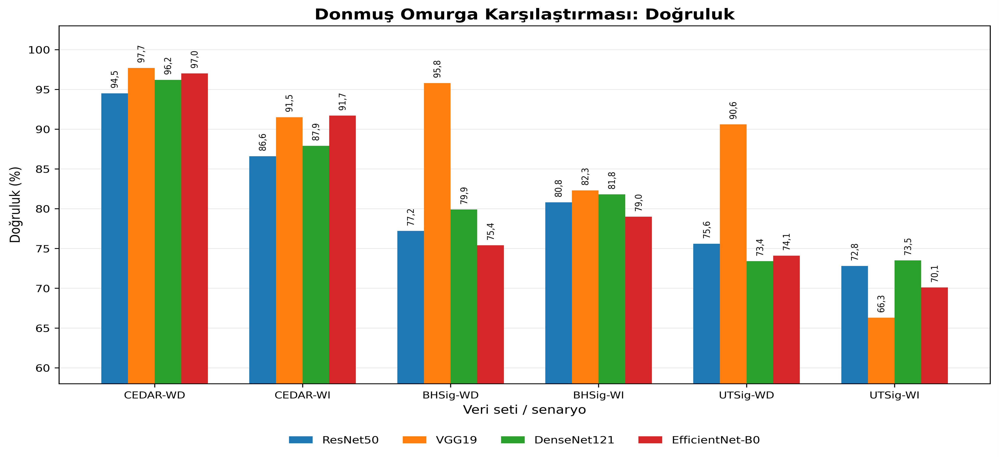
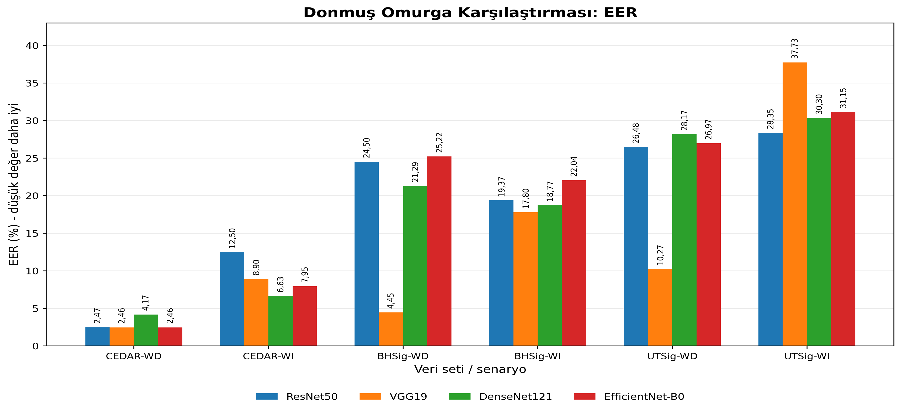
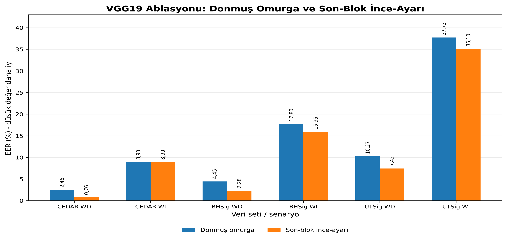

# Offline Signature Verification Across Writing Systems

A controlled comparison of offline handwritten signature verification across **three writing systems** — Latin (CEDAR), Bengali + Devanagari (BHSig260), and Perso-Arabic (UTSig) — using **transfer learning with four ImageNet-pretrained CNN backbones** under one identical protocol, plus a **frozen-vs-last-block fine-tuning ablation** on VGG19.

> 🇹🇷 For the Turkish version, see [README.tr.md](README.tr.md).

---

## Motivation

Most offline signature verification studies evaluate a method on a **single dataset**, often with a **single architecture** and a single evaluation protocol. This makes it difficult to determine whether a reported performance gap is caused by the intrinsic difficulty of the dataset, the writing system, the model architecture, or the evaluation scenario.

This project addresses that problem through a unified experimental design. Every experiment follows the same pipeline, uses the same codebase, the same preprocessing procedure, the same random seed, and the same training protocol. The controlled variables are:

* the dataset / writing system,
* the evaluation scenario: writer-dependent (WD) or writer-independent (WI),
* the CNN backbone,
* and, for the ablation study, whether VGG19 is kept frozen or partially fine-tuned.

The goal is not only to report high accuracy, but to examine how robust transfer learning is when the writing system, writer split protocol, and backbone architecture change.

---

## Study design

This study evaluates offline signature verification under a unified and controlled experimental framework:

* **Three datasets / writing systems:** CEDAR, BHSig260, and UTSig
* **Two evaluation scenarios per dataset:** writer-dependent (WD) and writer-independent (WI)
* **Four frozen ImageNet-pretrained CNN backbones:** ResNet50, VGG19, DenseNet121, and EfficientNet-B0
* **VGG19 ablation:** frozen backbone vs last-block fine-tuning
* **Biometric evaluation for all models:** FAR, FRR, AER, EER, and ROC-AUC
* **30 model runs in total:**

  * 24 frozen-backbone runs: `4 backbones × 3 datasets × 2 scenarios`
  * 6 fine-tuning ablation runs on VGG19

---

## Experimental workflow

The figure below summarizes the unified experimental protocol used throughout the study.



### Core design

* **Frozen-backbone transfer learning:**
  All four CNN backbones are initialized with ImageNet-pretrained weights. In the main comparison, the convolutional backbone is frozen and only the classifier head is trained.

* **Writer-dependent and writer-independent evaluation:**
  Each dataset is evaluated under two scenarios:

  * **Writer-Dependent (WD):** random image-level split; the same writer may appear in both training and test sets.
  * **Writer-Independent (WI):** writer-disjoint split; test writers are never seen during training.

* **VGG19 ablation:**
  After the frozen-backbone comparison, the last convolutional block of VGG19 is unfrozen and fine-tuned with a smaller learning rate (`lr = 1e-5`) to measure the effect of partial fine-tuning.

* **Classifier head:**
  `Dropout(0.3) → FC(256) + ReLU → Dropout(0.3) → FC(2)`

* **Evaluation metrics:**
  Accuracy, Precision, Recall, F1, ROC-AUC, FAR, FRR, AER, and EER.

---

## Results

## 1. Multi-backbone comparison

The frozen-backbone comparison shows that **backbone choice strongly affects performance**, especially on the more challenging non-Latin datasets.

### Accuracy comparison



### EER comparison



---

## Classification metrics: frozen backbone

| Dataset / Scenario | Backbone        |       Acc |      Prec |       Rec |        F1 |       AUC |
| ------------------ | --------------- | --------: | --------: | --------: | --------: | --------: |
| CEDAR-WD           | ResNet50        |     0.945 |     0.914 |     0.981 |     0.946 |     0.991 |
| CEDAR-WD           | VGG19           | **0.977** | **0.963** | **0.992** | **0.977** | **0.996** |
| CEDAR-WD           | DenseNet121     |     0.962 |     0.958 |     0.966 |     0.962 |     0.996 |
| CEDAR-WD           | EfficientNet-B0 |     0.970 |     0.966 |     0.973 |     0.970 |     0.994 |
| CEDAR-WI           | ResNet50        |     0.866 |     0.832 |     0.917 |     0.872 |     0.938 |
| CEDAR-WI           | VGG19           |     0.915 | **0.954** |     0.871 |     0.911 |     0.976 |
| CEDAR-WI           | DenseNet121     |     0.879 |     0.817 | **0.977** |     0.890 | **0.985** |
| CEDAR-WI           | EfficientNet-B0 | **0.917** |     0.882 |     0.962 | **0.920** |     0.981 |
| BHSig-WD           | ResNet50        |     0.772 |     0.770 |     0.675 |     0.719 |     0.831 |
| BHSig-WD           | VGG19           | **0.958** | **0.961** | **0.943** | **0.952** | **0.992** |
| BHSig-WD           | DenseNet121     |     0.799 |     0.785 |     0.739 |     0.761 |     0.872 |
| BHSig-WD           | EfficientNet-B0 |     0.754 |     0.753 |     0.642 |     0.693 |     0.820 |
| BHSig-WI           | ResNet50        |     0.808 |     0.812 |     0.740 |     0.775 |     0.880 |
| BHSig-WI           | VGG19           | **0.823** |     0.804 | **0.794** | **0.799** |     0.885 |
| BHSig-WI           | DenseNet121     |     0.818 |     0.799 |     0.791 |     0.795 | **0.892** |
| BHSig-WI           | EfficientNet-B0 |     0.790 | **0.842** |     0.650 |     0.734 |     0.868 |
| UTSig-WD           | ResNet50        |     0.756 |     0.724 |     0.673 |     0.697 |     0.827 |
| UTSig-WD           | VGG19           | **0.906** | **0.927** | **0.842** | **0.882** | **0.961** |
| UTSig-WD           | DenseNet121     |     0.734 |     0.694 |     0.647 |     0.670 |     0.797 |
| UTSig-WD           | EfficientNet-B0 |     0.741 |     0.695 |     0.677 |     0.686 |     0.812 |
| UTSig-WI           | ResNet50        |     0.728 |     0.665 |     0.614 | **0.638** | **0.794** |
| UTSig-WI           | VGG19           |     0.663 |     0.633 |     0.330 |     0.434 |     0.690 |
| UTSig-WI           | DenseNet121     | **0.735** | **0.698** |     0.568 |     0.626 |     0.788 |
| UTSig-WI           | EfficientNet-B0 |     0.701 |     0.617 | **0.620** |     0.619 |     0.749 |

---

## Biometric metrics: frozen backbone

| Dataset / Scenario | Backbone        |        FAR |        FRR |        AER |        EER |       AUC |
| ------------------ | --------------- | ---------: | ---------: | ---------: | ---------: | --------: |
| CEDAR-WD           | ResNet50        |      8.99% |      1.92% |      5.45% |      2.47% |     0.991 |
| CEDAR-WD           | VGG19           |      3.75% |  **0.77%** |  **2.26%** |  **2.46%** | **0.996** |
| CEDAR-WD           | DenseNet121     |      4.12% |      3.45% |      3.78% |      4.17% | **0.996** |
| CEDAR-WD           | EfficientNet-B0 |  **3.37%** |      2.68% |      3.03% |  **2.46%** |     0.994 |
| CEDAR-WI           | ResNet50        |     18.56% |      8.33% |     13.45% |     12.50% |     0.938 |
| CEDAR-WI           | VGG19           |  **4.17%** |     12.88% |  **8.52%** |      8.90% |     0.976 |
| CEDAR-WI           | DenseNet121     |     21.97% |  **2.27%** |     12.12% |  **6.63%** | **0.985** |
| CEDAR-WI           | EfficientNet-B0 |     12.88% |      3.79% |      8.33% |      7.95% |     0.981 |
| BHSig-WD           | ResNet50        |     15.40% |     32.54% |     23.97% |     24.50% |     0.831 |
| BHSig-WD           | VGG19           |  **2.95%** |  **5.75%** |  **4.35%** |  **4.45%** | **0.992** |
| BHSig-WD           | DenseNet121     |     15.46% |     26.13% |     20.80% |     21.29% |     0.872 |
| BHSig-WD           | EfficientNet-B0 |     16.09% |     35.83% |     25.96% |     25.22% |     0.820 |
| BHSig-WI           | ResNet50        |     13.72% |     25.96% |     19.84% |     19.37% |     0.880 |
| BHSig-WI           | VGG19           |     15.45% | **20.59%** | **18.02%** | **17.80%** |     0.885 |
| BHSig-WI           | DenseNet121     |     15.96% |     20.91% |     18.44% |     18.77% | **0.892** |
| BHSig-WI           | EfficientNet-B0 |  **9.74%** |     35.02% |     22.38% |     22.04% |     0.868 |
| UTSig-WD           | ResNet50        |     18.40% |     32.73% |     25.56% |     26.48% |     0.827 |
| UTSig-WD           | VGG19           |  **4.76%** | **15.84%** | **10.30%** | **10.27%** | **0.961** |
| UTSig-WD           | DenseNet121     |     20.45% |     35.29% |     27.87% |     28.17% |     0.797 |
| UTSig-WD           | EfficientNet-B0 |     21.32% |     32.28% |     26.80% |     26.97% |     0.812 |
| UTSig-WI           | ResNet50        |     19.88% |     38.65% | **29.26%** | **28.35%** | **0.794** |
| UTSig-WI           | VGG19           | **12.32%** |     66.99% |     39.65% |     37.73% |     0.690 |
| UTSig-WI           | DenseNet121     |     15.84% |     43.16% |     29.50% |     30.30% |     0.788 |
| UTSig-WI           | EfficientNet-B0 |     24.74% | **38.00%** |     31.37% |     31.15% |     0.749 |

---

## Interpretation of the multi-backbone comparison

VGG19 provides the strongest overall performance in most scenarios, especially in writer-dependent settings. However, this advantage is not universal. In **UTSig-WI**, VGG19 performs poorly, with recall dropping to **0.330** and FRR rising to **66.99%**, indicating a substantial generalization loss under the most challenging writer-independent Perso-Arabic setting.

This result suggests that high-capacity architectures may not always be the safest choice when the task requires generalization to unseen writers, especially under a writing system that differs substantially from the visual patterns represented in ImageNet.

---

## 2. VGG19 ablation: frozen vs last-block fine-tuning

The ablation study compares frozen VGG19 against VGG19 with the last convolutional block unfrozen and fine-tuned.



---

## VGG19 ablation: classification and AUC

| Dataset / Scenario | Acc Frozen | Acc Fine-tuned |  Δ Acc | AUC Frozen | AUC Fine-tuned |
| ------------------ | ---------: | -------------: | -----: | ---------: | -------------: |
| CEDAR-WD           |      0.977 |      **0.991** | +0.014 |      0.996 |      **1.000** |
| CEDAR-WI           |  **0.915** |          0.901 | −0.014 |  **0.976** |          0.967 |
| BHSig-WD           |      0.958 |      **0.978** | +0.020 |      0.992 |      **0.998** |
| BHSig-WI           |      0.823 |      **0.842** | +0.019 |      0.885 |      **0.901** |
| UTSig-WD           |      0.906 |      **0.927** | +0.021 |      0.961 |      **0.973** |
| UTSig-WI           |      0.663 |      **0.687** | +0.024 |      0.690 |      **0.718** |

---

## VGG19 ablation: biometric metrics

| Dataset / Scenario | Setup      |        FAR |        FRR |        AER |        EER |       AUC |
| ------------------ | ---------- | ---------: | ---------: | ---------: | ---------: | --------: |
| CEDAR-WD           | Frozen     |      3.75% |      0.77% |      2.26% |      2.46% |     0.996 |
| CEDAR-WD           | Fine-tuned |  **1.87%** |  **0.00%** |  **0.94%** |  **0.76%** | **1.000** |
| CEDAR-WI           | Frozen     |  **4.17%** |     12.88% |  **8.52%** |      8.90% | **0.976** |
| CEDAR-WI           | Fine-tuned |      8.33% | **11.36%** |      9.85% |      8.90% |     0.967 |
| BHSig-WD           | Frozen     |      2.95% |      5.75% |      4.35% |      4.45% |     0.992 |
| BHSig-WD           | Fine-tuned |  **1.19%** |  **3.45%** |  **2.32%** |  **2.28%** | **0.998** |
| BHSig-WI           | Frozen     | **15.45%** |     20.59% |     18.02% |     17.80% |     0.885 |
| BHSig-WI           | Fine-tuned |     15.58% | **16.19%** | **15.88%** | **15.95%** | **0.901** |
| UTSig-WD           | Frozen     |  **4.76%** |     15.84% |     10.30% |     10.27% |     0.961 |
| UTSig-WD           | Fine-tuned |      7.25% |  **7.39%** |  **7.32%** |  **7.43%** | **0.973** |
| UTSig-WI           | Frozen     | **12.32%** |     66.99% |     39.65% |     37.73% |     0.690 |
| UTSig-WI           | Fine-tuned |     13.25% | **59.42%** | **36.34%** | **35.10%** | **0.718** |

---

## Interpretation of the ablation study

Last-block fine-tuning generally improves EER and AUC, especially in writer-dependent settings. However, it does **not** guarantee better generalization.

In **CEDAR-WI**, accuracy and AUC decrease while EER remains unchanged. In **UTSig-WI**, fine-tuning improves EER slightly, but the model still rejects a large proportion of genuine signatures. This suggests that partial fine-tuning is useful in some settings but remains conditional, especially under writer-independent evaluation.

---

## Main findings

This study shows that offline signature verification performance is strongly shaped by the interaction between:

* **writing system**
* **writer split protocol: WD vs WI**
* **CNN backbone**
* **fine-tuning strategy**

### Key observations

* VGG19 is the strongest overall backbone in most scenarios, but not in all.
* Writer-independent evaluation is substantially more challenging because the model must generalize to unseen writers.
* UTSig-WI is the most difficult setting in this study, especially for VGG19.
* Fine-tuning the last block helps in several scenarios, but its benefit is conditional and can be unreliable under writer-independent evaluation.
* High performance on a single dataset, a single backbone, or a single split protocol is not sufficient evidence of generalizability.

---

## Datasets

| Property           |   CEDAR |             BHSig260 |        UTSig |
| ------------------ | ------: | -------------------: | -----------: |
| Writing system     |   Latin | Bengali + Devanagari | Perso-Arabic |
| Writers            |      55 |                  260 |          115 |
| Genuine signatures |   1,320 |                6,240 |        3,105 |
| Forged signatures  |   1,320 |                7,800 |        4,830 |
| Total used         |   2,640 |               14,040 |        7,935 |
| Forgery type       | Skilled |              Skilled |      Skilled |

For UTSig, **opposite-hand samples were excluded**. Only genuine and skilled-forgery signatures were used:

```text
115 × (27 genuine + 42 skilled forgeries) = 7,935
```

The datasets themselves are **not redistributed** in this repository. Please obtain them from their original sources and configure the dataset paths in `src/signature_data.py`.

---

## Repository structure

```text
.
├── src/
│   ├── signature_data.py            # dataset loading and WD/WI splitting
│   ├── train_unified.py             # training: --dataset --scenario --backbone --finetune
│   ├── compute_biometrics_all.py    # FAR, FRR, AER, EER for all saved models
│   └── aggregate_results.py         # result aggregation and figure generation
├── results/
│   ├── figures/                     # accuracy, EER, and ablation figures
│   └── metrics/                     # classification and biometric result tables
├── docs/
│   └── architecture_multibackbone.png
├── paper/                           # manuscript files
├── requirements.txt
├── LICENSE
└── README.md
```

---

## Installation

```bash
pip install -r requirements.txt
```

The code requires **Python 3.9+** and **PyTorch**. A GPU is recommended, but the experiments can also be run on CPU.

---

## Usage

Edit dataset paths at the top of `src/signature_data.py`, then run the experiments.

### Frozen-backbone comparison

```bash
cd src

python train_unified.py --dataset cedar --scenario wd --backbone resnet50
python train_unified.py --dataset cedar --scenario wd --backbone vgg19
python train_unified.py --dataset cedar --scenario wd --backbone densenet121
python train_unified.py --dataset cedar --scenario wd --backbone efficientnet_b0

python train_unified.py --dataset bhsig260 --scenario wi --backbone vgg19
python train_unified.py --dataset utsig --scenario wi --backbone densenet121
```

Run all combinations for:

```text
4 backbones × 3 datasets × 2 scenarios = 24 frozen-backbone experiments
```

### VGG19 last-block fine-tuning ablation

```bash
python train_unified.py --dataset cedar --scenario wd --backbone vgg19 --finetune last_block
python train_unified.py --dataset bhsig260 --scenario wi --backbone vgg19 --finetune last_block
python train_unified.py --dataset utsig --scenario wi --backbone vgg19 --finetune last_block
```

### Aggregate results

```bash
python aggregate_results.py
python compute_biometrics_all.py
```

---

## Training protocol

| Hyperparameter            | Value                                            |
| ------------------------- | ------------------------------------------------ |
| Backbones                 | ResNet50, VGG19, DenseNet121, EfficientNet-B0    |
| Pretraining               | ImageNet                                         |
| Main setting              | Frozen convolutional backbone                    |
| Classifier head           | Dropout 0.3 → FC 256 → ReLU → Dropout 0.3 → FC 2 |
| Fine-tuning ablation      | VGG19 last convolutional block unfrozen          |
| Fine-tuning learning rate | 1e-5                                             |
| Optimizer                 | Adam                                             |
| Head learning rate        | 1e-4                                             |
| Weight decay              | 5e-4                                             |
| Batch size                | 32                                               |
| Epochs                    | 30                                               |
| Early stopping            | patience = 5                                     |
| Image size                | 224 × 224                                        |
| Normalization             | ImageNet statistics                              |
| Random seed               | 42                                               |

---

## Reproducibility

All splits are deterministic and use the same random seed (`42`). The same dataset loading and splitting module is used for all backbones and scenarios, ensuring that models are evaluated on the corresponding deterministic hold-out split.

In the writer-independent setting, the split is writer-disjoint: test writers are never included in the training writers. This prevents writer identity leakage across training and test sets.

---

## Limitations

This repository reports a controlled **single-seed** experimental setup. Although this improves reproducibility, it does not fully characterize variance across random splits. Future work should include repeated runs with different seeds and multi-split or k-fold evaluation.

Another limitation is that early stopping uses the hold-out evaluation split rather than a fully separate validation set. A separate validation set would provide a cleaner separation between model selection and final testing.

Finally, the UTSig-WI failure mode requires deeper analysis. The observed performance drop may be caused by overfitting, representation mismatch between ImageNet features and Perso-Arabic signatures, limited writer diversity, or a combination of these factors.

---

## Citation

If you use this code or results, please cite the accompanying manuscript in `paper/`.

A BibTeX entry will be added after publication.

---

## License

Released under the MIT License. See [LICENSE](LICENSE).
