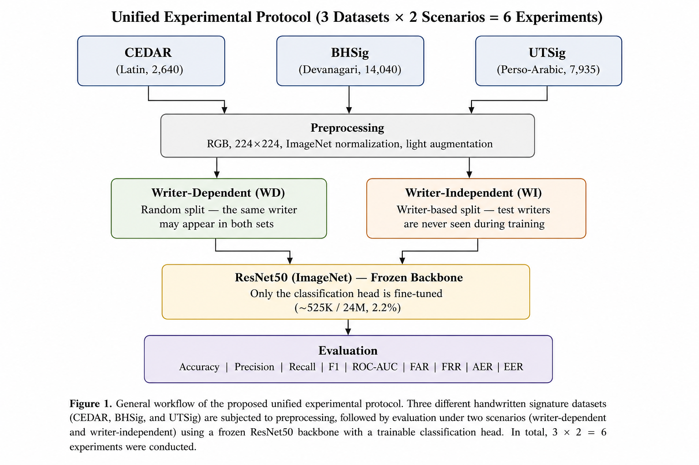
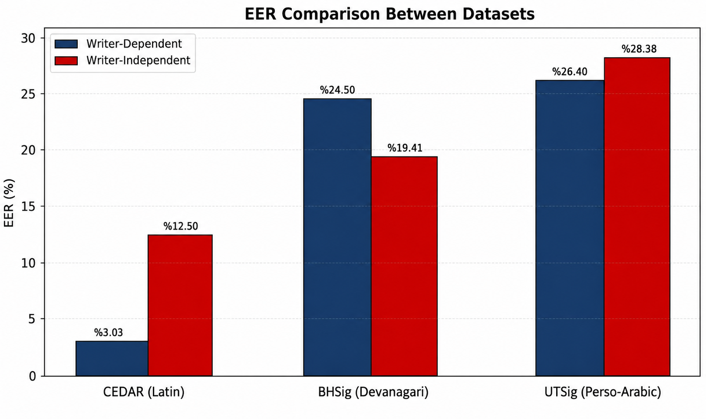

# Offline Signature Verification Across Writing Systems

A fair, controlled comparison of offline handwritten signature verification across **three writing systems** — Latin (CEDAR), Devanagari (BHSig), and Perso-Arabic (UTSig) — using a frozen-backbone ResNet50 transfer-learning approach.

> 🇹🇷 Türkçe açıklama için [README.tr.md](README.tr.md) dosyasına bakın.

---

## Motivation

Most offline signature verification studies evaluate on a **single dataset** (usually Latin-script CEDAR) and rarely test whether the reported performance generalizes to other writing systems. Moreover, methodological choices (preprocessing, architecture, training budget) differ from paper to paper, so it is hard to tell whether a performance gap reflects the **intrinsic difficulty of the data** or just differences in method.

This project removes that ambiguity: **all six experiments share one identical protocol** — same backbone, same hyperparameters, same code, same random seed. The only variables are *which dataset* and *which scenario* (writer-dependent vs writer-independent).

## Key Idea

- **Frozen ResNet50 backbone** (ImageNet pre-trained): only the classifier head (~525K of 24M parameters, ~2.2%) is trained.
- **Two scenarios per dataset:**
  - **Writer-Dependent (WD):** random split; the same writer may appear in both train and test.
  - **Writer-Independent (WI):** writer-disjoint split; test writers are never seen in training.
- **Biometric evaluation:** beyond accuracy/precision/recall/F1, we report FAR, FRR, AER, and EER.



## Results

### Classification metrics

| Dataset | Scenario | Accuracy | Precision | Recall | F1 | ROC-AUC |
|---------|----------|---------:|----------:|-------:|------:|--------:|
| CEDAR (Latin)       | WD | 0.945 | 0.914 | 0.981 | 0.946 | 0.991 |
| CEDAR (Latin)       | WI | 0.866 | 0.832 | 0.917 | 0.872 | 0.938 |
| BHSig (Devanagari)  | WD | 0.772 | 0.770 | 0.675 | 0.719 | 0.831 |
| BHSig (Devanagari)  | WI | 0.808 | 0.812 | 0.740 | 0.775 | 0.880 |
| UTSig (Perso-Arabic)| WD | 0.756 | 0.724 | 0.673 | 0.697 | 0.827 |
| UTSig (Perso-Arabic)| WI | 0.728 | 0.665 | 0.614 | 0.638 | 0.794 |

### Biometric metrics (%)

| Dataset | Scenario | FAR | FRR | AER | EER |
|---------|----------|----:|----:|----:|----:|
| CEDAR (Latin)       | WD |  8.99 |  1.92 |  5.45 |  **3.03** |
| CEDAR (Latin)       | WI | 18.56 |  8.33 | 13.45 | **12.50** |
| BHSig (Devanagari)  | WD | 15.40 | 32.54 | 23.97 | **24.50** |
| BHSig (Devanagari)  | WI | 13.72 | 25.96 | 19.84 | **19.41** |
| UTSig (Perso-Arabic)| WD | 18.40 | 32.73 | 25.56 | **26.40** |
| UTSig (Perso-Arabic)| WI | 19.88 | 38.65 | 29.26 | **28.38** |

### Main finding

A clear **difficulty ordering by writing system** emerges: **CEDAR < BHSig < UTSig** (Latin easiest, Perso-Arabic hardest). The gap *between* datasets is much larger than the WD–WI gap *within* a dataset — i.e., the **dataset effect dominates the scenario effect**. This suggests the frozen ImageNet feature extractor aligns far better with Latin-script signatures than with Devanagari or Perso-Arabic ones, and that high accuracy on a single dataset is not by itself evidence of generalizability.



## Datasets

| Property | CEDAR | BHSig | UTSig |
|----------|------:|------:|------:|
| Writing system | Latin | Devanagari | Perso-Arabic |
| Writers | 55 | 260 | 115 |
| Genuine | 1,320 | 6,240 | 3,105 |
| Forged | 1,320 | 7,800 | 4,830 |
| Total | 2,640 | 14,040 | 7,935 |
| Forgery type | Amateur | Skilled | Skilled |

> The datasets themselves are **not** redistributed here. Obtain them from their original sources and arrange each as `train/{genuine,forged}` and `test/{genuine,forged}`. Update the paths at the top of `src/signature_data.py`.

## Repository structure

```
.
├── src/
│   ├── signature_data.py            # dataset loading + WD/WI splitting (one place for all 3 datasets)
│   ├── train_unified.py             # training driver: --dataset {cedar,bhsig,utsig} --scenario {wd,wi}
│   └── compute_metrics_unified.py   # FAR/FRR/AER/EER + comparison plots for all six models
├── results/
│   ├── figures/                     # generated comparison charts
│   └── metrics/                     # per-scenario + aggregate JSON metrics
├── docs/
│   └── methodology.png              # pipeline diagram
├── paper/                           # manuscript (docx + pdf)
├── requirements.txt
├── LICENSE
└── README.md
```

## Installation

```bash
pip install -r requirements.txt
```

Requires Python 3.9+ and PyTorch. A GPU is recommended but not required (these experiments were run on CPU).

## Usage

Edit the dataset paths at the top of `src/signature_data.py`, then run each experiment:

```bash
cd src
python train_unified.py --dataset cedar --scenario wd
python train_unified.py --dataset cedar --scenario wi
python train_unified.py --dataset bhsig --scenario wd
python train_unified.py --dataset bhsig --scenario wi
python train_unified.py --dataset utsig --scenario wd
python train_unified.py --dataset utsig --scenario wi
```

Then aggregate biometric metrics and generate all comparison plots:

```bash
python compute_metrics_unified.py
```

Outputs are written to `outputs_unified/<dataset>_<scenario>/` (per-model artifacts) and `outputs_unified/_metrics/` (aggregate metrics + figures).

## Training protocol (identical for all six experiments)

| Hyperparameter | Value |
|----------------|-------|
| Backbone | ResNet50 (ImageNet), frozen |
| Trainable params | ~525K / 24M (2.2%) |
| Optimizer | Adam, lr = 1e-4 |
| Weight decay | 5e-4 |
| Batch size | 32 |
| Epochs | 30 (early stopping, patience = 5) |
| Dropout | 0.3 |
| Image size | 224 × 224 |
| Seed | 42 |

## Reproducibility

Splits are performed in memory with a fixed seed (42) and are fully deterministic — `train_unified.py` and `compute_metrics_unified.py` use the same `signature_data` module, so each model is always evaluated on exactly the test set it was trained against.

## Citation

If you use this code, please cite the accompanying manuscript (see `paper/`). A BibTeX entry will be added upon publication.

## License

Released under the MIT License — see [LICENSE](LICENSE).
