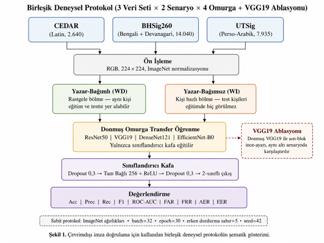

# Yazı Sistemleri Arasında Çevrimdışı İmza Doğrulama

Bu çalışma, **üç farklı yazı sistemine** ait çevrimdışı el yazısı imza veri setleri üzerinde kontrollü bir karşılaştırma sunar: Latin (CEDAR), Bengali + Devanagari (BHSig260) ve Perso-Arabik (UTSig). Çalışmada, **ImageNet üzerinde önceden eğitilmiş dört CNN omurgası** aynı deneysel protokol altında transfer öğrenme yaklaşımıyla değerlendirilmiş; ayrıca VGG19 üzerinde **donmuş omurga ve son-blok ince-ayar** karşılaştırması yapılmıştır.

> 🇬🇧 İngilizce açıklama için [README.md](README.md) dosyasına bakın.

---

## Motivasyon

Çevrimdışı imza doğrulama çalışmalarının büyük bölümü, bir yöntemi yalnızca **tek bir veri seti**, **tek bir mimari** ve çoğu zaman **tek bir değerlendirme protokolü** üzerinde test etmektedir. Bu durum, raporlanan başarım farklarının gerçekten veri setinin içsel zorluğundan mı, yazı sisteminden mi, kullanılan model mimarisinden mi yoksa değerlendirme senaryosundan mı kaynaklandığını belirsiz bırakmaktadır.

Bu proje, bu belirsizliği azaltmak için birleşik ve kontrollü bir deneysel tasarım kullanır. Tüm deneylerde aynı kod tabanı, aynı ön işleme adımları, aynı rastgelelik tohumu ve aynı eğitim protokolü kullanılmıştır. Değişen faktörler yalnızca şunlardır:

* veri seti / yazı sistemi,
* değerlendirme senaryosu: yazar-bağımlı (WD) veya yazar-bağımsız (WI),
* CNN omurgası,
* ve ablasyon çalışması için VGG19 omurgasının donmuş bırakılması ya da kısmen ince-ayarlanması.

Çalışmanın amacı yalnızca yüksek doğruluk raporlamak değil; transfer öğrenmenin yazı sistemi, yazar bölme protokolü ve mimari değiştiğinde ne kadar sağlam kaldığını incelemektir.

---

## Çalışma tasarımı

Bu çalışma, çevrimdışı imza doğrulamayı birleşik ve kontrollü bir deneysel çerçevede değerlendirir:

* **Üç veri seti / yazı sistemi:** CEDAR, BHSig260 ve UTSig
* **Her veri seti için iki değerlendirme senaryosu:** yazar-bağımlı (WD) ve yazar-bağımsız (WI)
* **Dört donmuş ImageNet ön-eğitimli CNN omurgası:** ResNet50, VGG19, DenseNet121 ve EfficientNet-B0
* **VGG19 ablasyonu:** donmuş omurga ve son-blok ince-ayar karşılaştırması
* **Tüm modeller için biyometrik değerlendirme:** FAR, FRR, AER, EER ve ROC-AUC
* **Toplam 30 model koşusu:**

  * 24 donmuş-omurga koşusu: `4 omurga × 3 veri seti × 2 senaryo`
  * 6 VGG19 ince-ayar ablasyon koşusu

---

## Deneysel iş akışı

Aşağıdaki şekil, çalışma boyunca kullanılan birleşik deneysel protokolü özetlemektedir.



### Temel tasarım

* **Donmuş-omurga transfer öğrenme:**
  Dört CNN omurgası da ImageNet üzerinde önceden eğitilmiş ağırlıklarla başlatılmıştır. Ana karşılaştırmada evrişimsel omurga dondurulmuş, yalnızca sınıflandırıcı kafa eğitilmiştir.

* **Yazar-bağımlı ve yazar-bağımsız değerlendirme:**
  Her veri seti iki senaryoda değerlendirilmiştir:

  * **Yazar-Bağımlı (WD):** rastgele görüntü düzeyinde bölme; aynı yazar hem eğitim hem test kümesinde yer alabilir.
  * **Yazar-Bağımsız (WI):** yazar bazlı ayrık bölme; test yazarları eğitimde hiç görülmez.

* **VGG19 ablasyonu:**
  Donmuş omurga karşılaştırmasından sonra, VGG19'un son evrişim bloğu çözülmüş ve daha küçük bir öğrenme oranıyla (`lr = 1e-5`) ince-ayarlanmıştır. Böylece kısmi ince-ayarın etkisi ölçülmüştür.

* **Sınıflandırıcı kafa:**
  `Dropout(0.3) → FC(256) + ReLU → Dropout(0.3) → FC(2)`

* **Değerlendirme metrikleri:**
  Doğruluk (Accuracy), Kesinlik (Precision), Duyarlılık (Recall), F1, ROC-AUC, FAR, FRR, AER ve EER.

---

## Sonuçlar

## 1. Çoklu omurga karşılaştırması

Donmuş omurga karşılaştırması, özellikle daha zorlu Latin-dışı veri setlerinde **omurga seçiminin başarımı güçlü biçimde etkilediğini** göstermektedir.

### Doğruluk karşılaştırması


### EER karşılaştırması


---

## Sınıflandırma metrikleri: donmuş omurga

| Veri Seti / Senaryo | Omurga          |       Acc |      Prec |       Rec |        F1 |       AUC |
| ------------------- | --------------- | --------: | --------: | --------: | --------: | --------: |
| CEDAR-WD            | ResNet50        |     0.945 |     0.914 |     0.981 |     0.946 |     0.991 |
| CEDAR-WD            | VGG19           | **0.977** | **0.963** | **0.992** | **0.977** | **0.996** |
| CEDAR-WD            | DenseNet121     |     0.962 |     0.958 |     0.966 |     0.962 |     0.996 |
| CEDAR-WD            | EfficientNet-B0 |     0.970 |     0.966 |     0.973 |     0.970 |     0.994 |
| CEDAR-WI            | ResNet50        |     0.866 |     0.832 |     0.917 |     0.872 |     0.938 |
| CEDAR-WI            | VGG19           |     0.915 | **0.954** |     0.871 |     0.911 |     0.976 |
| CEDAR-WI            | DenseNet121     |     0.879 |     0.817 | **0.977** |     0.890 | **0.985** |
| CEDAR-WI            | EfficientNet-B0 | **0.917** |     0.882 |     0.962 | **0.920** |     0.981 |
| BHSig-WD            | ResNet50        |     0.772 |     0.770 |     0.675 |     0.719 |     0.831 |
| BHSig-WD            | VGG19           | **0.958** | **0.961** | **0.943** | **0.952** | **0.992** |
| BHSig-WD            | DenseNet121     |     0.799 |     0.785 |     0.739 |     0.761 |     0.872 |
| BHSig-WD            | EfficientNet-B0 |     0.754 |     0.753 |     0.642 |     0.693 |     0.820 |
| BHSig-WI            | ResNet50        |     0.808 |     0.812 |     0.740 |     0.775 |     0.880 |
| BHSig-WI            | VGG19           | **0.823** |     0.804 | **0.794** | **0.799** |     0.885 |
| BHSig-WI            | DenseNet121     |     0.818 |     0.799 |     0.791 |     0.795 | **0.892** |
| BHSig-WI            | EfficientNet-B0 |     0.790 | **0.842** |     0.650 |     0.734 |     0.868 |
| UTSig-WD            | ResNet50        |     0.756 |     0.724 |     0.673 |     0.697 |     0.827 |
| UTSig-WD            | VGG19           | **0.906** | **0.927** | **0.842** | **0.882** | **0.961** |
| UTSig-WD            | DenseNet121     |     0.734 |     0.694 |     0.647 |     0.670 |     0.797 |
| UTSig-WD            | EfficientNet-B0 |     0.741 |     0.695 |     0.677 |     0.686 |     0.812 |
| UTSig-WI            | ResNet50        |     0.728 |     0.665 |     0.614 | **0.638** | **0.794** |
| UTSig-WI            | VGG19           |     0.663 |     0.633 |     0.330 |     0.434 |     0.690 |
| UTSig-WI            | DenseNet121     | **0.735** | **0.698** |     0.568 |     0.626 |     0.788 |
| UTSig-WI            | EfficientNet-B0 |     0.701 |     0.617 | **0.620** |     0.619 |     0.749 |

---

## Biyometrik metrikler: donmuş omurga

| Veri Seti / Senaryo | Omurga          |        FAR |        FRR |        AER |        EER |       AUC |
| ------------------- | --------------- | ---------: | ---------: | ---------: | ---------: | --------: |
| CEDAR-WD            | ResNet50        |      8.99% |      1.92% |      5.45% |      2.47% |     0.991 |
| CEDAR-WD            | VGG19           |      3.75% |  **0.77%** |  **2.26%** |  **2.46%** | **0.996** |
| CEDAR-WD            | DenseNet121     |      4.12% |      3.45% |      3.78% |      4.17% | **0.996** |
| CEDAR-WD            | EfficientNet-B0 |  **3.37%** |      2.68% |      3.03% |  **2.46%** |     0.994 |
| CEDAR-WI            | ResNet50        |     18.56% |      8.33% |     13.45% |     12.50% |     0.938 |
| CEDAR-WI            | VGG19           |  **4.17%** |     12.88% |  **8.52%** |      8.90% |     0.976 |
| CEDAR-WI            | DenseNet121     |     21.97% |  **2.27%** |     12.12% |  **6.63%** | **0.985** |
| CEDAR-WI            | EfficientNet-B0 |     12.88% |      3.79% |      8.33% |      7.95% |     0.981 |
| BHSig-WD            | ResNet50        |     15.40% |     32.54% |     23.97% |     24.50% |     0.831 |
| BHSig-WD            | VGG19           |  **2.95%** |  **5.75%** |  **4.35%** |  **4.45%** | **0.992** |
| BHSig-WD            | DenseNet121     |     15.46% |     26.13% |     20.80% |     21.29% |     0.872 |
| BHSig-WD            | EfficientNet-B0 |     16.09% |     35.83% |     25.96% |     25.22% |     0.820 |
| BHSig-WI            | ResNet50        |     13.72% |     25.96% |     19.84% |     19.37% |     0.880 |
| BHSig-WI            | VGG19           |     15.45% | **20.59%** | **18.02%** | **17.80%** |     0.885 |
| BHSig-WI            | DenseNet121     |     15.96% |     20.91% |     18.44% |     18.77% | **0.892** |
| BHSig-WI            | EfficientNet-B0 |  **9.74%** |     35.02% |     22.38% |     22.04% |     0.868 |
| UTSig-WD            | ResNet50        |     18.40% |     32.73% |     25.56% |     26.48% |     0.827 |
| UTSig-WD            | VGG19           |  **4.76%** | **15.84%** | **10.30%** | **10.27%** | **0.961** |
| UTSig-WD            | DenseNet121     |     20.45% |     35.29% |     27.87% |     28.17% |     0.797 |
| UTSig-WD            | EfficientNet-B0 |     21.32% |     32.28% |     26.80% |     26.97% |     0.812 |
| UTSig-WI            | ResNet50        |     19.88% |     38.65% | **29.26%** | **28.35%** | **0.794** |
| UTSig-WI            | VGG19           | **12.32%** |     66.99% |     39.65% |     37.73% |     0.690 |
| UTSig-WI            | DenseNet121     |     15.84% |     43.16% |     29.50% |     30.30% |     0.788 |
| UTSig-WI            | EfficientNet-B0 |     24.74% | **38.00%** |     31.37% |     31.15% |     0.749 |

---

## Çoklu omurga karşılaştırmasının yorumu

VGG19 çoğu senaryoda, özellikle yazar-bağımlı kurulumlarda, en güçlü genel başarımı üretmiştir. Ancak bu üstünlük tüm koşullarda geçerli değildir. **UTSig-WI** senaryosunda VGG19'un duyarlılığı **0.330** seviyesine düşmüş ve FRR değeri **%66.99** olmuştur. Bu durum, en zorlu yazar-bağımsız Perso-Arabik senaryoda ciddi bir genelleme kaybına işaret etmektedir.

Bu sonuç, yüksek kapasiteli mimarilerin özellikle hiç görülmemiş yazarlara genelleme gerektiren koşullarda her zaman en güvenli seçenek olmadığını göstermektedir. Bu etki, ImageNet temsilleri ile Perso-Arabik imza yapısı arasındaki temsil uyumsuzluğu, aşırı uyum veya sınırlı yazar çeşitliliğiyle ilişkili olabilir.

---

## 2. VGG19 ablasyonu: donmuş omurga ve son-blok ince-ayar

Ablasyon çalışmasında, donmuş VGG19 ile son evrişim bloğu çözülen ve ince-ayarlanan VGG19 karşılaştırılmıştır.


---

## VGG19 ablasyonu: sınıflandırma ve AUC

| Veri Seti / Senaryo | Acc Donmuş | Acc İnce-ayar |  Δ Acc | AUC Donmuş | AUC İnce-ayar |
| ------------------- | ---------: | ------------: | -----: | ---------: | ------------: |
| CEDAR-WD            |      0.977 |     **0.991** | +0.014 |      0.996 |     **1.000** |
| CEDAR-WI            |  **0.915** |         0.901 | −0.014 |  **0.976** |         0.967 |
| BHSig-WD            |      0.958 |     **0.978** | +0.020 |      0.992 |     **0.998** |
| BHSig-WI            |      0.823 |     **0.842** | +0.019 |      0.885 |     **0.901** |
| UTSig-WD            |      0.906 |     **0.927** | +0.021 |      0.961 |     **0.973** |
| UTSig-WI            |      0.663 |     **0.687** | +0.024 |      0.690 |     **0.718** |

---

## VGG19 ablasyonu: biyometrik metrikler

| Veri Seti / Senaryo | Kurulum   |        FAR |        FRR |        AER |        EER |       AUC |
| ------------------- | --------- | ---------: | ---------: | ---------: | ---------: | --------: |
| CEDAR-WD            | Donmuş    |      3.75% |      0.77% |      2.26% |      2.46% |     0.996 |
| CEDAR-WD            | İnce-ayar |  **1.87%** |  **0.00%** |  **0.94%** |  **0.76%** | **1.000** |
| CEDAR-WI            | Donmuş    |  **4.17%** |     12.88% |  **8.52%** |      8.90% | **0.976** |
| CEDAR-WI            | İnce-ayar |      8.33% | **11.36%** |      9.85% |      8.90% |     0.967 |
| BHSig-WD            | Donmuş    |      2.95% |      5.75% |      4.35% |      4.45% |     0.992 |
| BHSig-WD            | İnce-ayar |  **1.19%** |  **3.45%** |  **2.32%** |  **2.28%** | **0.998** |
| BHSig-WI            | Donmuş    | **15.45%** |     20.59% |     18.02% |     17.80% |     0.885 |
| BHSig-WI            | İnce-ayar |     15.58% | **16.19%** | **15.88%** | **15.95%** | **0.901** |
| UTSig-WD            | Donmuş    |  **4.76%** |     15.84% |     10.30% |     10.27% |     0.961 |
| UTSig-WD            | İnce-ayar |      7.25% |  **7.39%** |  **7.32%** |  **7.43%** | **0.973** |
| UTSig-WI            | Donmuş    | **12.32%** |     66.99% |     39.65% |     37.73% |     0.690 |
| UTSig-WI            | İnce-ayar |     13.25% | **59.42%** | **36.34%** | **35.10%** | **0.718** |

---

## Ablasyon çalışmasının yorumu

Son-blok ince-ayar, genel olarak EER ve AUC değerlerini iyileştirmiştir; özellikle yazar-bağımlı senaryolarda daha belirgin fayda sağlamıştır. Ancak bu fayda her koşulda güvenilir değildir.

**CEDAR-WI** senaryosunda doğruluk ve AUC düşerken EER değişmemiştir. **UTSig-WI** senaryosunda ise ince-ayar EER değerini bir miktar iyileştirse de model hâlâ gerçek imzaların büyük bir kısmını reddetmektedir. Bu sonuç, kısmi ince-ayarın özellikle yazar-bağımsız değerlendirme altında koşullu bir iyileştirme sağladığını göstermektedir.

---

## Ana bulgular

Bu çalışma, çevrimdışı imza doğrulama başarımının şu faktörlerin etkileşimiyle güçlü biçimde şekillendiğini göstermektedir:

* **yazı sistemi**
* **yazar bölme protokolü: WD ve WI**
* **CNN omurgası**
* **ince-ayar stratejisi**

### Temel gözlemler

* VGG19 çoğu senaryoda en güçlü genel omurgadır, ancak her senaryoda en iyi değildir.
* Yazar-bağımsız değerlendirme daha zordur; çünkü model eğitimde hiç görmediği yazarlara genelleme yapmak zorundadır.
* UTSig-WI bu çalışmadaki en zor senaryodur; özellikle VGG19 için belirgin bir genelleme kaybı üretmiştir.
* Son-blok ince-ayar bazı senaryolarda faydalıdır; ancak yazar-bağımsız değerlendirmede güvenilir ve koşulsuz bir iyileştirme sağlamaz.
* Tek bir veri seti, tek bir omurga veya tek bir değerlendirme protokolü üzerinde elde edilen yüksek başarım, genellenebilirlik için tek başına yeterli kanıt değildir.

---

## Veri setleri

| Özellik                 |     CEDAR |             BHSig260 |        UTSig |
| ----------------------- | --------: | -------------------: | -----------: |
| Yazı sistemi            |     Latin | Bengali + Devanagari | Perso-Arabik |
| Yazar sayısı            |        55 |                  260 |          115 |
| Gerçek imza             |     1,320 |                6,240 |        3,105 |
| Sahte imza              |     1,320 |                7,800 |        4,830 |
| Kullanılan toplam örnek |     2,640 |               14,040 |        7,935 |
| Sahtecilik türü         | Yetenekli |            Yetenekli |    Yetenekli |

UTSig veri setinde **ters elle atılmış (opposite-hand) örnekler** çalışmaya dâhil edilmemiştir. Yalnızca gerçek ve yetenekli sahte imzalar kullanılmıştır:

```text id="hl0h4m"
115 × (27 gerçek + 42 yetenekli sahte) = 7,935
```

Veri setleri bu depoda **yeniden dağıtılmamaktadır**. Lütfen veri setlerini kendi orijinal kaynaklarından edinin ve veri yollarını `src/signature_data.py` dosyasında yapılandırın.

---

## Depo yapısı

```text id="1ctz0j"
.
├── src/
│   ├── signature_data.py            # veri yükleme ve WD/WI bölme işlemleri
│   ├── train_unified.py             # eğitim: --dataset --scenario --backbone --finetune
│   ├── compute_biometrics_all.py    # tüm modeller için FAR, FRR, AER, EER hesaplama
│   └── aggregate_results.py         # sonuç toplama ve grafik üretimi
├── results/
│   ├── figures/                     # doğruluk, EER ve ablasyon grafikleri
│   └── metrics/                     # sınıflandırma ve biyometrik sonuç tabloları
├── docs/
│   └── architecture_multibackbone.png
├── paper/                           # makale dosyaları
├── requirements.txt
├── LICENSE
└── README.md
```

---

## Kurulum

```bash id="t4sx8i"
pip install -r requirements.txt
```

Kodlar **Python 3.9+** ve **PyTorch** gerektirir. GPU önerilir; ancak deneyler CPU üzerinde de çalıştırılabilir.

---

## Kullanım

Öncelikle `src/signature_data.py` dosyasının başındaki veri seti yollarını düzenleyin. Ardından deneyleri çalıştırın.

### Donmuş omurga karşılaştırması

```bash id="6urwmj"
cd src

python train_unified.py --dataset cedar --scenario wd --backbone resnet50
python train_unified.py --dataset cedar --scenario wd --backbone vgg19
python train_unified.py --dataset cedar --scenario wd --backbone densenet121
python train_unified.py --dataset cedar --scenario wd --backbone efficientnet_b0

python train_unified.py --dataset bhsig260 --scenario wi --backbone vgg19
python train_unified.py --dataset utsig --scenario wi --backbone densenet121
```

Tüm donmuş omurga deneyleri için şu kombinasyonlar çalıştırılır:

```text id="jfs8j8"
4 omurga × 3 veri seti × 2 senaryo = 24 donmuş-omurga deneyi
```

### VGG19 son-blok ince-ayar ablasyonu

```bash id="ew3m4w"
python train_unified.py --dataset cedar --scenario wd --backbone vgg19 --finetune last_block
python train_unified.py --dataset bhsig260 --scenario wi --backbone vgg19 --finetune last_block
python train_unified.py --dataset utsig --scenario wi --backbone vgg19 --finetune last_block
```

### Sonuçları toplama

```bash id="oo1pmg"
python aggregate_results.py
python compute_biometrics_all.py
```

---

## Eğitim protokolü

| Hiperparametre          | Değer                                            |
| ----------------------- | ------------------------------------------------ |
| Omurgalar               | ResNet50, VGG19, DenseNet121, EfficientNet-B0    |
| Ön eğitim               | ImageNet                                         |
| Ana kurulum             | Donmuş evrişimsel omurga                         |
| Sınıflandırıcı kafa     | Dropout 0.3 → FC 256 → ReLU → Dropout 0.3 → FC 2 |
| İnce-ayar ablasyonu     | VGG19 son evrişim bloğu çözülür                  |
| İnce-ayar öğrenme oranı | 1e-5                                             |
| Optimizasyon            | Adam                                             |
| Kafa öğrenme oranı      | 1e-4                                             |
| Ağırlık sönümü          | 5e-4                                             |
| Batch boyutu            | 32                                               |
| Epoch sayısı            | 30                                               |
| Erken durdurma          | patience = 5                                     |
| Görüntü boyutu          | 224 × 224                                        |
| Normalizasyon           | ImageNet istatistikleri                          |
| Rastgelelik tohumu      | 42                                               |

---

## Tekrarlanabilirlik

Tüm bölmeler deterministik olarak gerçekleştirilmiştir ve aynı rastgelelik tohumu (`42`) kullanılmıştır. Tüm omurgalar ve senaryolar için aynı veri yükleme ve bölme modülü kullanılır. Böylece her model, kendi deterministik hold-out bölmesi üzerinde değerlendirilir.

Yazar-bağımsız kurulumda bölme yazar bazında ayrık yapılır: test yazarları eğitim yazarları arasında yer almaz. Bu durum, eğitim ve test arasında yazar kimliği sızıntısını engeller.

---

## Sınırlılıklar

Bu depo, kontrollü ancak **tek tohumlu** bir deneysel kurulum raporlamaktadır. Bu durum tekrarlanabilirliği artırsa da farklı rastgele bölmeler arasındaki varyansı tam olarak göstermez. Gelecek çalışmalarda farklı tohumlarla tekrarlı deneyler ve çoklu bölme ya da k-katlı değerlendirme yapılmalıdır.

Bir diğer sınırlılık, erken durdurmada tamamen ayrı bir doğrulama kümesi yerine hold-out değerlendirme bölmesinin kullanılmasıdır. Bağımsız bir doğrulama kümesi, model seçimi ile nihai test başarımını daha temiz biçimde ayırabilir.

Son olarak, UTSig-WI senaryosundaki başarım düşüşü daha ayrıntılı analiz gerektirmektedir. Gözlenen düşüş; aşırı uyum, ImageNet öznitelikleri ile Perso-Arabik imzalar arasındaki temsil uyumsuzluğu, sınırlı yazar çeşitliliği veya bunların birleşiminden kaynaklanıyor olabilir.

---

## Atıf

Bu kodu veya sonuçları kullanırsanız, lütfen `paper/` klasöründeki ilgili makaleye atıf yapın.

Yayın sonrasında BibTeX girdisi eklenecektir.

---

## Lisans

Bu proje MIT Lisansı altında yayımlanmıştır. Ayrıntılar için [LICENSE](LICENSE) dosyasına bakın.
