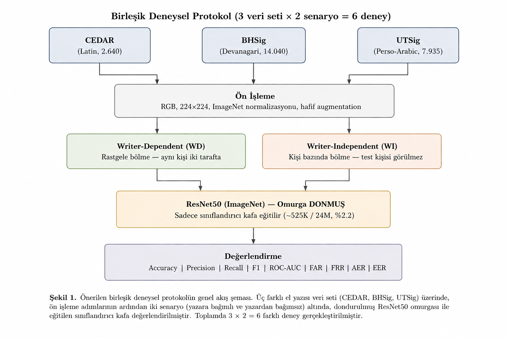
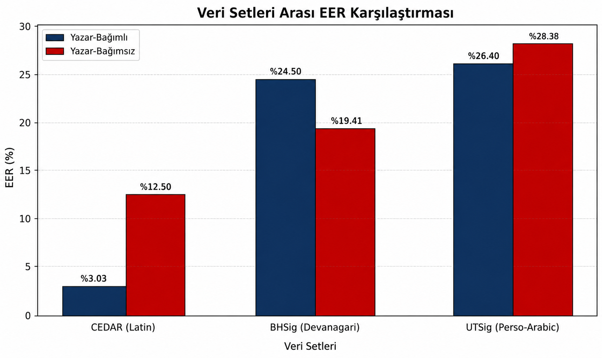

# Yazı Sistemleri Arası Çevrimdışı İmza Doğrulama

Üç farklı **yazı sistemi** — Latin (CEDAR), Devanagari (BHSig) ve Perso-Arabik (UTSig) — üzerinde, donmuş omurgalı ResNet50 transfer öğrenme yaklaşımıyla yapılan **adil ve kontrollü** bir çevrimdışı el yazısı imza doğrulama karşılaştırması.

> 🇬🇧 For English, see [README.md](README.md).

---

## Motivasyon

Çevrimdışı imza doğrulama çalışmalarının çoğu **tek bir veri seti** (genellikle Latin karakterli CEDAR) üzerinde değerlendirilir ve elde edilen başarımın diğer yazı sistemlerine genellenip genellenmediği nadiren test edilir. Üstelik yöntemsel tercihler (ön işleme, mimari, eğitim bütçesi) çalışmadan çalışmaya değiştiği için, raporlanan bir başarım farkının **verinin içsel zorluğundan** mı yoksa yalnızca yöntem farklılıklarından mı kaynaklandığını anlamak zordur.

Bu proje o belirsizliği ortadan kaldırır: **altı deneyin tamamı tek ve özdeş bir protokolü paylaşır** — aynı omurga, aynı hiperparametreler, aynı kod, aynı rastgelelik tohumu. Tek değişkenler *hangi veri seti* ve *hangi senaryo* (yazar-bağımlı / yazar-bağımsız) olduğudur.

## Temel Fikir

- **Donmuş ResNet50 omurgası** (ImageNet ön eğitimli): yalnızca sınıflandırıcı kafa eğitilir (24M parametrenin ~525K'sı, ~%2,2).
- **Veri seti başına iki senaryo:**
  - **Yazar-bağımlı (WD):** rastgele bölme; aynı kişi hem eğitim hem testte olabilir.
  - **Yazar-bağımsız (WI):** kişi-ayrık bölme; test kişileri eğitimde hiç görülmez.
- **Biyometrik değerlendirme:** doğruluk/kesinlik/duyarlılık/F1'in yanı sıra FAR, FRR, AER ve EER raporlanır.



## Sonuçlar

### Sınıflandırma metrikleri

| Veri Seti | Senaryo | Doğruluk | Kesinlik | Duyarlılık | F1 | ROC-AUC |
|-----------|---------|---------:|---------:|-----------:|------:|--------:|
| CEDAR (Latin)        | WD | 0,945 | 0,914 | 0,981 | 0,946 | 0,991 |
| CEDAR (Latin)        | WI | 0,866 | 0,832 | 0,917 | 0,872 | 0,938 |
| BHSig (Devanagari)   | WD | 0,772 | 0,770 | 0,675 | 0,719 | 0,831 |
| BHSig (Devanagari)   | WI | 0,808 | 0,812 | 0,740 | 0,775 | 0,880 |
| UTSig (Perso-Arabik) | WD | 0,756 | 0,724 | 0,673 | 0,697 | 0,827 |
| UTSig (Perso-Arabik) | WI | 0,728 | 0,665 | 0,614 | 0,638 | 0,794 |

### Biyometrik metrikler (%)

| Veri Seti | Senaryo | FAR | FRR | AER | EER |
|-----------|---------|----:|----:|----:|----:|
| CEDAR (Latin)        | WD |  8,99 |  1,92 |  5,45 |  **3,03** |
| CEDAR (Latin)        | WI | 18,56 |  8,33 | 13,45 | **12,50** |
| BHSig (Devanagari)   | WD | 15,40 | 32,54 | 23,97 | **24,50** |
| BHSig (Devanagari)   | WI | 13,72 | 25,96 | 19,84 | **19,41** |
| UTSig (Perso-Arabik) | WD | 18,40 | 32,73 | 25,56 | **26,40** |
| UTSig (Perso-Arabik) | WI | 19,88 | 38,65 | 29,26 | **28,38** |

### Ana Bulgu

Yazı sistemine göre net bir **zorluk sıralaması** ortaya çıkar: **CEDAR < BHSig < UTSig** (Latin en kolay, Perso-Arabik en zor). Veri setleri *arasındaki* fark, aynı veri seti *içindeki* WD–WI farkından çok daha büyüktür — yani **veri seti etkisi senaryo etkisinden baskındır**. Bu, donmuş ImageNet öznitelik çıkarıcısının Latin imzalara, Devanagari ve Perso-Arabik imzalardan çok daha iyi uyduğunu; tek bir veri setindeki yüksek doğruluğun tek başına genellenebilirlik kanıtı olmadığını gösterir.



## Veri Setleri

| Özellik | CEDAR | BHSig | UTSig |
|---------|------:|------:|------:|
| Yazı sistemi | Latin | Devanagari | Perso-Arabik |
| Kişi sayısı | 55 | 260 | 115 |
| Gerçek | 1.320 | 6.240 | 3.105 |
| Sahte | 1.320 | 7.800 | 4.830 |
| Toplam | 2.640 | 14.040 | 7.935 |
| Sahtecilik | Amatör | Yetenekli | Yetenekli |

> Veri setleri burada **paylaşılmaz**. Orijinal kaynaklarından edinip her birini `train/{genuine,forged}` ve `test/{genuine,forged}` biçiminde düzenleyin. Yolları `src/signature_data.py` dosyasının başından güncelleyin.

## Depo Yapısı

```
.
├── src/
│   ├── signature_data.py            # veri yükleme + WD/WI bölme (üç veri seti tek yerde)
│   ├── train_unified.py             # eğitim sürücüsü: --dataset {cedar,bhsig,utsig} --scenario {wd,wi}
│   └── compute_metrics_unified.py   # altı model için FAR/FRR/AER/EER + karşılaştırma grafikleri
├── results/
│   ├── figures/                     # üretilen karşılaştırma grafikleri
│   └── metrics/                     # senaryo bazında + toplu JSON metrikler
├── docs/
│   └── methodology.png              # yöntem akış diyagramı
├── paper/                           # makale (docx + pdf)
├── requirements.txt
├── LICENSE
└── README.md
```

## Kurulum

```bash
pip install -r requirements.txt
```

Python 3.9+ ve PyTorch gerektirir. GPU önerilir ama zorunlu değildir (bu deneyler CPU üzerinde çalıştırılmıştır).

## Kullanım

`src/signature_data.py` başındaki veri yollarını düzenleyin, ardından her deneyi çalıştırın:

```bash
cd src
python train_unified.py --dataset cedar --scenario wd
python train_unified.py --dataset cedar --scenario wi
python train_unified.py --dataset bhsig --scenario wd
python train_unified.py --dataset bhsig --scenario wi
python train_unified.py --dataset utsig --scenario wd
python train_unified.py --dataset utsig --scenario wi
```

Sonra biyometrik metrikleri toplayıp tüm grafikleri üretin:

```bash
python compute_metrics_unified.py
```

Çıktılar `outputs_unified/<veri>_<senaryo>/` (model başına) ve `outputs_unified/_metrics/` (toplu metrik + grafikler) altına yazılır.

## Eğitim Protokolü (altı deney için özdeş)

| Hiperparametre | Değer |
|----------------|-------|
| Omurga | ResNet50 (ImageNet), donmuş |
| Eğitilen parametre | ~525K / 24M (%2,2) |
| Optimizasyon | Adam, lr = 1e-4 |
| Ağırlık sönümü | 5e-4 |
| Batch boyutu | 32 |
| Epoch | 30 (erken durdurma, sabır = 5) |
| Dropout | 0,3 |
| Görüntü boyutu | 224 × 224 |
| Tohum | 42 |

## Tekrar Üretilebilirlik

Bölmeler sabit tohumla (42) bellekte yapılır ve tamamen deterministiktir — `train_unified.py` ve `compute_metrics_unified.py` aynı `signature_data` modülünü kullandığından, her model tam olarak eğitildiği test kümesi üzerinde değerlendirilir.

## Atıf

Bu kodu kullanırsanız ekteki makaleye atıf yapınız (bkz. `paper/`). Yayımlandığında BibTeX kaydı eklenecektir.

## Lisans

MIT Lisansı ile yayımlanmıştır — bkz. [LICENSE](LICENSE).
